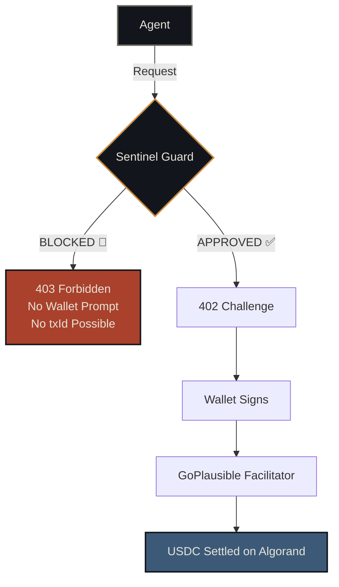
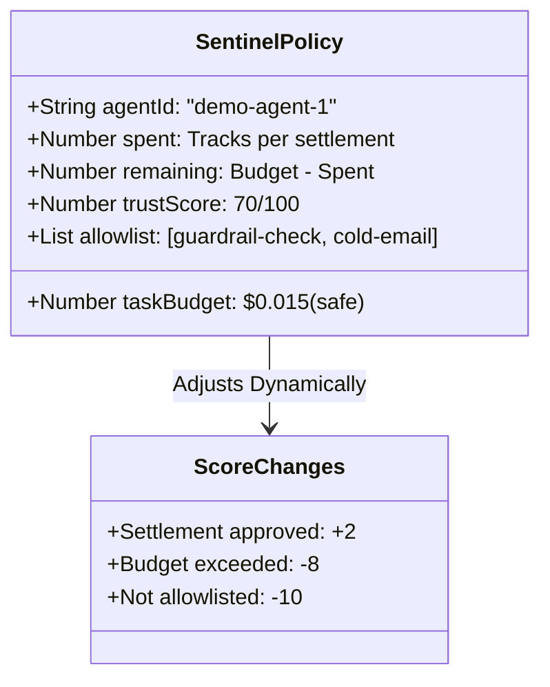
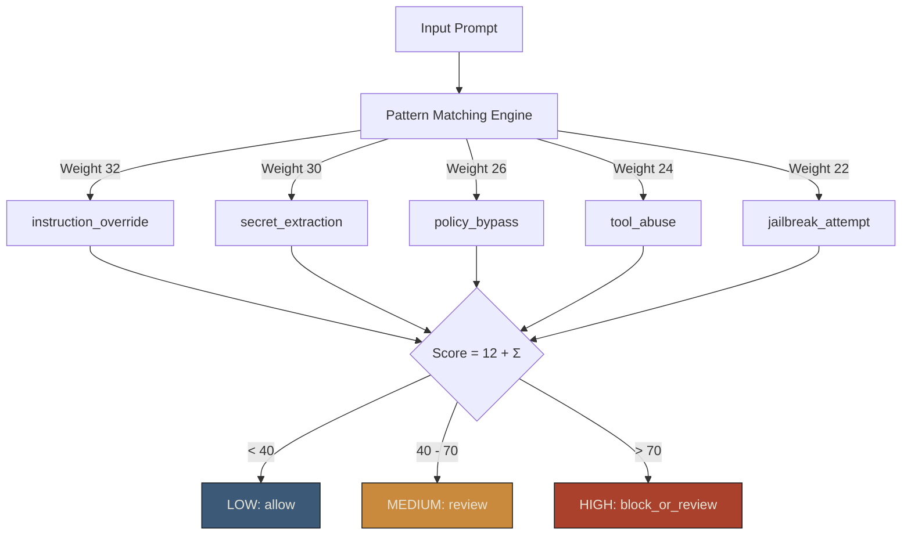
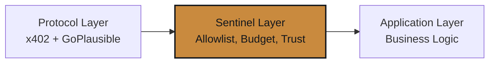

# 🛡️ Sentinel

<div align="center">

**The policy and audit layer for x402 agent payments on Algorand.**

*Not just pay-per-call. **Governed** pay-per-call.*

[](https://testnet.algoexplorer.io)
[](https://x402.org)
[](https://www.circle.com/en/usdc)
[](https://goplausible.xyz)
[](LICENSE)

</div>

---

## 🛑 The Problem

AI agents that use x402 to call paid APIs face an unresolved control problem:


**Who decides what the agent is allowed to pay for?**  
**What prevents it from burning its entire budget on one bad call?**  
**How do you prove, on-chain, that unsafe calls were stopped?**

Sentinel answers all three.

---

## ⚡ The Solution



The critical insight: **denied requests never become payment challenges.**  
The Algorand explorer shows nothing for blocked calls — because nothing happened.

---

## 🏗 Architecture

### Middleware Stack

```mermaid
sequenceDiagram
    participant C as Client Request
    participant CORS as CORS & Preflight
    participant L as Logger
    participant SG as Sentinel Guard
    participant X as x402 Middleware
    participant RH as Route Handler

    C->>CORS: Request
    CORS->>L: Pass
    L->>SG: Logged
    
    rect rgb(30, 35, 42)
    Note over SG: 1. Endpoint Allowlisted?<br>2. Budget Available?<br>3. Trust Score Acceptable?
    end
    
    alt Policy Failed
        SG-->>C: 403 Forbidden (Blocked)
    else Policy Passed
        SG->>X: Approved
        X->>RH: Payment Verified
        RH-->>C: Response + txId
    end
```



### Policy Engine



### Event Audit Trail (Every Request Logged)

```typescript
type SentinelEvent = {
  id:                       string    // evt-{timestamp}-{n}
  timestamp:                string    // ISO 8601
  agentId:                  string    // agent identity
  endpoint:                 string    // which API was called
  priceMicroUsdc:           number    // cost in microUSDC
  decision:                 'approved' | 'blocked'
  reason:                   string    // exact policy reason
  paymentChallengeCreated:  boolean   // false for blocked
  walletSignatureRequested: boolean   // false for blocked
  settled:                  boolean   // false for blocked
  txId?:                    string    // only for settled
  explorerUrl?:             string    // Lora testnet link
}
```

---

## 🎮 Live Demo Flow

### The Hero Proof

```
Algorand TestNet Explorer

  ✅ FOUND:   guardrail-check payment
              From: <your wallet>
              To:   <AVM_ADDRESS>
              Asset: USDC (ASA 10458941)
              Amount: 10,000 microUSDC ($0.01)

  ❌ NOT FOUND: cold-email payment
  ❌ NOT FOUND: premium-research payment

  → These transactions do not exist because
    Sentinel blocked them before payment creation.
```

---

## 🛡️ Guardrail Risk Engine



Demo prompt triggers: `instruction_override` + `secret_extraction` + `tool_abuse`  
→ Score: **98** · Risk: **HIGH** · Recommendation: **block_or_review**

---

## 📂 Project Structure

```
sentinel-app/
│
├── x402-demo-server/                    # Hono Resource Server (TypeScript)
│   │
│   ├── handlers/
│   │   ├── sentinelState.ts             # Policy engine, trust score, event log
│   │   ├── sentinelGuard.ts             # Middleware: policy check before x402
│   │   ├── guardrailCheck.ts            # Prompt risk scanner  — $0.01 USDC
│   │   ├── coldEmail.ts                 # Outbound generator   — $0.02 USDC
│   │   ├── premiumResearch.ts           # Blocked endpoint     — $0.05 USDC
│   │   └── sentinelStatus.ts            # Status, reset, demo-mode handlers
│   │
│   ├── endpoints.config.ts              # x402 price + asset configuration
│   ├── index.ts                         # App entry, middleware ordering
│   └── .env.example                     # Required env vars (safe to commit)
│
└── X402-Usecase/projects/X402-Usecase/  # React + Vite Frontend (Framer Motion UI)
    └── src/
        ├── components/
        │   └── SentinelDashboard.tsx    # Full agent console UI
        ├── utils/
        │   ├── sentinelApi.ts           # API client (reset, status, demo-mode)
        │   ├── weatherApi.ts            # x402 fetch wrapper + signer
        │   └── walletSession.ts         # Session clearing utilities
        └── App.tsx                      # Wallet config (Lute browser extension)
```

---

## 🔌 API Reference

### Sentinel-Protected Endpoints

| Method | Route | Price | Sentinel | Description |
|:---:|:---|:---:|:---:|:---|
| `POST` | `/guardrail-check` | $0.01 | ✅ Allowlisted | NLP prompt risk scanner — returns score, flags, recommendation |
| `POST` | `/cold-email` | $0.02 | ✅ Allowlisted | Outbound email generator — blocked when budget exhausted |
| `POST` | `/premium-research` | $0.05 | ❌ Blocked | Always denied — proves allowlist enforcement works |

### x402-Only Endpoints

| Method | Route | Price | Description |
|:---:|:---|:---:|:---|
| `GET` | `/weather` | $0.005 | Weather data (original starter) |
| `POST` | `/meme-generate` | $0.10 | AI meme generator |

### Public Endpoints

| Method | Route | Description |
|:---:|:---|:---|
| `GET` | `/health` | Server liveness |
| `GET` | `/info` | Registered endpoint list |
| `GET` | `/sentinel/status` | Live policy state + full event log |
| `POST` | `/sentinel/reset` | Reset budget and trust score |
| `POST` | `/sentinel/demo-mode` | Switch `safe` / `full` mode |

---

## 🚀 Quickstart

### Prerequisites

- **Node.js 18+**
- **[Lute Wallet](https://lute.app/)** — browser extension (Chrome/Firefox)
- **Algorand TestNet wallet** with:
  - TestNet ALGO → [dispenser](https://bank.testnet.algorand.network/)
  - TestNet USDC (ASA `10458941`) → opt-in via Lute, get from a faucet

### 1. Clone

```bash
git clone https://github.com/HARJAPAN2005/Sentinel.git
cd Sentinel/sentinel-app
```

### 2. Backend

```bash
cd x402-demo-server
npm install
cp .env.example .env
# Edit .env — set AVM_ADDRESS to your Algorand TestNet wallet
npm start
```

### 3. Frontend

```bash
cd ../X402-Usecase/projects/X402-Usecase
npm install
cp .env.example .env.local
npm run dev
```

Open **http://localhost:5173**

### 4. Demo

```
1. Click "Connect Wallet" → Choose Lute → Approve
2. Select mode: 🔒 Safe (1 settlement) or 🚀 Full (2 settlements)
3. Click "▶ Run Agent Task"
4. Watch: policy evaluation → 402 payment → on-chain settlement
5. Click "View on Algorand Explorer ↗" on the settled step
```

---

## ⚙️ Demo Modes

| Mode | Budget | `/guardrail-check` | `/cold-email` | `/premium-research` |
|:---:|:---:|:---:|:---:|:---:|
| 🔒 **Safe** | $0.015 | ✅ Settled | 🚫 Budget exceeded | 🚫 Not allowlisted |
| 🚀 **Full** | $0.040 | ✅ Settled | ✅ Settled | 🚫 Not allowlisted |

Switch modes live via the toggle in the dashboard header — resets budget + events automatically.

---

## 🛠 Tech Stack

| Layer | Technology | Version |
|:---|:---|:---:|
| Protocol | `@x402/hono` · `@x402/core` · `@x402/avm` | latest |
| Network | Algorand TestNet | — |
| Settlement | USDC (ASA `10458941`) via GoPlausible | — |
| Backend | Hono + TypeScript + Node.js | Hono 4.x |
| Frontend | React 18 + Vite + Tailwind + Framer Motion | Vite 5.x |
| Wallet | Lute + `@txnlab/use-wallet-react` | v4.x |
| Explorer | [Lora by AlgoKit](https://lora.algokit.io/testnet) | — |

---

## 🛡️ Security Scope

Sentinel enforces security at the **resource server middleware layer**:



**What Sentinel guarantees:**
- ✅ Blocked requests produce zero on-chain transactions
- ✅ Budget enforcement is exact — no overdraft possible
- ✅ Every decision (approved or blocked) is audited with full policyTrace
- ✅ Trust score decays automatically on violations

**What Sentinel does not claim:**
- Cryptographic agent identity verification
- Replay attack prevention (handled by x402/facilitator layer)
- Full protocol security

---

## 🌍 Mainnet Deployment

Two config changes for production:

```env
# Backend .env
AVM_ADDRESS=your_mainnet_address
FACILITATOR_URL=https://facilitator.goplausible.xyz

# Frontend .env.local
VITE_ALGOD_SERVER=https://mainnet-api.algonode.cloud
VITE_ALGOD_NETWORK=mainnet
```

Update `endpoints.config.ts` USDC asset ID from `10458941` (TestNet) → `31566704` (MainNet).

All policy logic, middleware ordering, and audit trail are identical in both environments.

---

## 🎤 One-Line Pitch

> *"Sentinel is the policy firewall for AI agent payments — it doesn't just let agents pay for APIs, it decides whether they're allowed to pay before a single wallet signature is ever requested."*

---

<div align="center">

**Built for HackNite Code Royale 2026 · x402 + Algorand Track**

[View on Algorand TestNet](https://lora.algokit.io/testnet) · [x402 Protocol](https://x402.org) · [GoPlausible](https://goplausible.xyz)

</div>
